 

Frontend engineer building **observable agent tools** and **legible interfaces**.

`TypeScript` &nbsp; `React` &nbsp; `Vue` &nbsp; `Vite` &nbsp; `Node.js` &nbsp; `Python`

## `./now`

`focus` agent runtime observability 
`building` local-first developer tools 
`bias` clarity over complexity

## `./toolbox`

`interface` React · Vue · TypeScript · Tailwind CSS 
`systems` state modeling · design systems · performance 
`tooling` Vite · Node.js · Git · agent harnesses

Make state inspectable. Keep interfaces legible.

